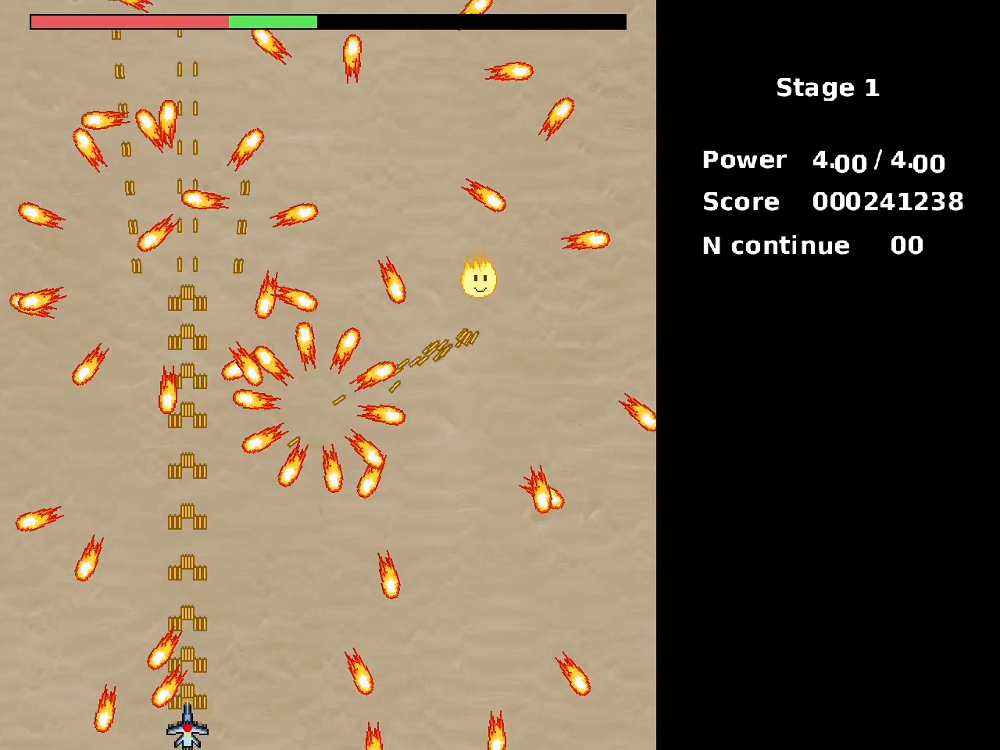
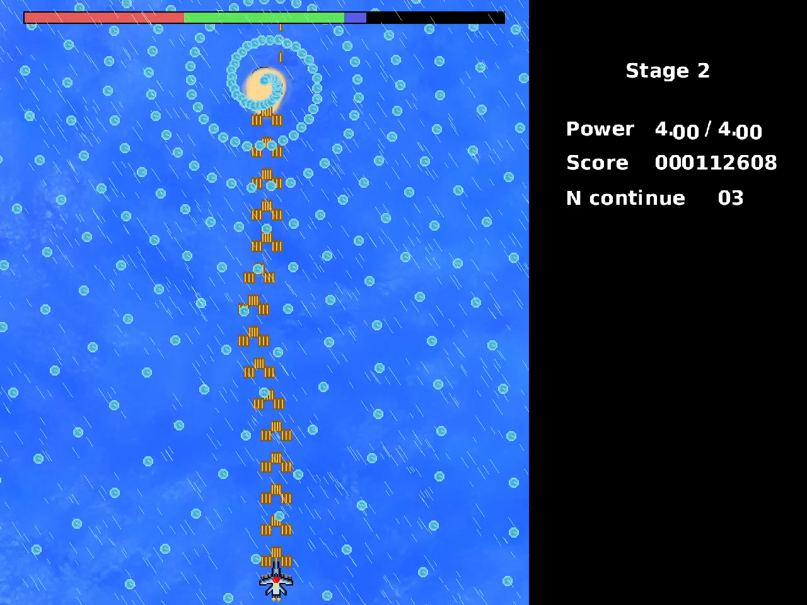

# Bullet Rain

Bullet Rain is a bullet hell game heavily inspired by Touhou 11.
It is my submission to the [OLCCODEJAM 2022](https://itch.io/jam/olc-codejam-2022).

## [DEMO](https://youtu.be/24OJUt6pmpk)

|  |  |
|--------------------------|--------------------------|


## The game

You are the best member of the Javidx9 special force. 
Your objective is simple: exterminate all species that have evolved due 
to global warming (and get the biggest score).

#### Controls
* Arrow keys to move in game and in menus
* X to fire
* <strong>Left</strong> shift to slow down. when you are in slow mode, you can also 
see your hitbox (it is smaller than your sprite).
* Escape / Control right to show menu in game

In-game, when you are dead, you can either choose, continue or restart:
restart will... restart the whole game, while continue let you restart to the last wave
with the same score and power you had at the beginning of the wave. Unfortunately,
continuing during the first boss, doesn't work properly: you have to fight the
boss and the last wave...

#### Power
Your power is indicated on the right of the screen. It is the amount of damage
each bullet make. When you pick up a power item, you gain 0.05 power. There are
also power caps:
* at power=2, you gain four more cannon
* At power=3, you gain four heat-seeking missile.

#### Score
You gain score by killing enemies, bosses, surviving and picking score items.
The score formula is the following:
```
SCORE = 
      (
          kill * 5000          // doesn't not count bosses
        + boss_killed * 50_000
        + score_item_picked * 100
        + tick_survived * 1
      ) / (number_of_continue + 1)
      + (all_enemy_killed ? 100_000 : 0)
```

#### Others

* You can move from the left side of the screen to right side and vice versa. 
But you need to push the left/right keys for 0.5 seconds
* When you move at the top of the screen, all items are attracted to you.
* You can see hitboxes with F4
* You can see 'debug' information with F3

#### Tips

* Slow down is very useful when there are a lots of bullet.
* Don't panic.
* Don't focus on score, abuse using 'continue'
* Power items are important but you first goal is to survive.
* There are some enemies that fire exactly at your position, but you don't need to do 
big moves to avoid bullets.

## Assets

* Explosions: https://opengameart.org/content/explosions-0
* Water background: https://lpc.opengameart.org/node/10510 (http://www.godsandidols.com/)
* Desert background: https://polyhaven.com/a/aerial_beach_01
* Fire dragon: http://pixelartmaker.com/art/9dfc135f738ce2a
* Ship: https://opengameart.org/content/sea-warfare-set-ships-and-more

All other assets where created by me.